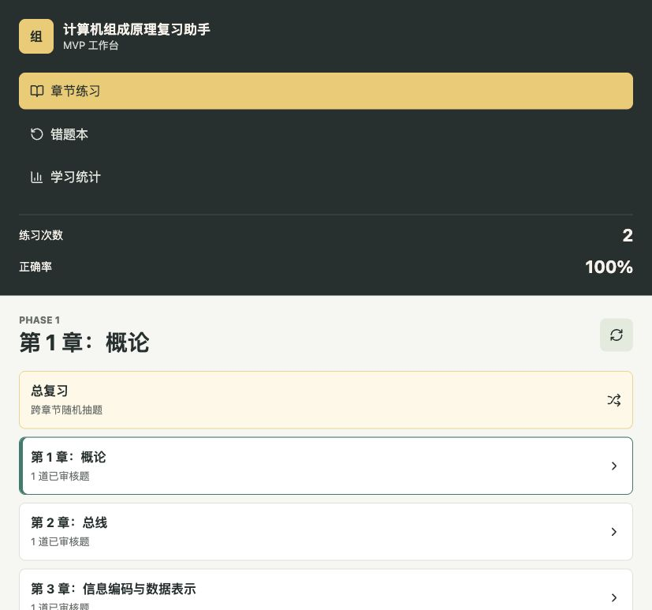
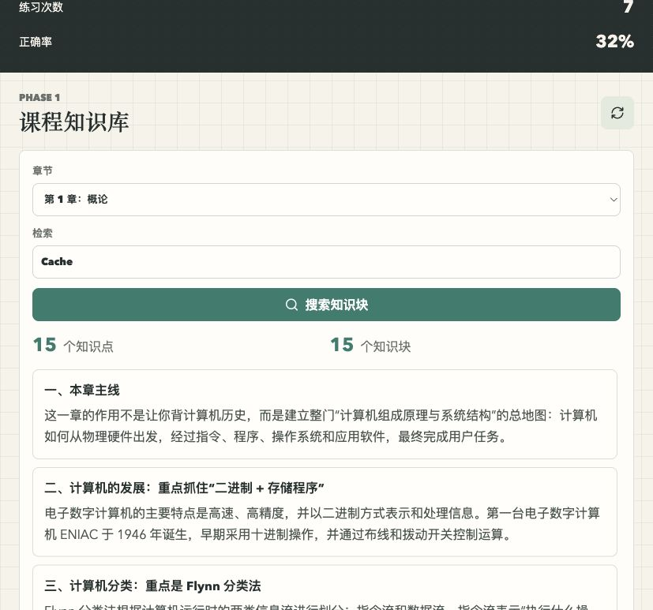
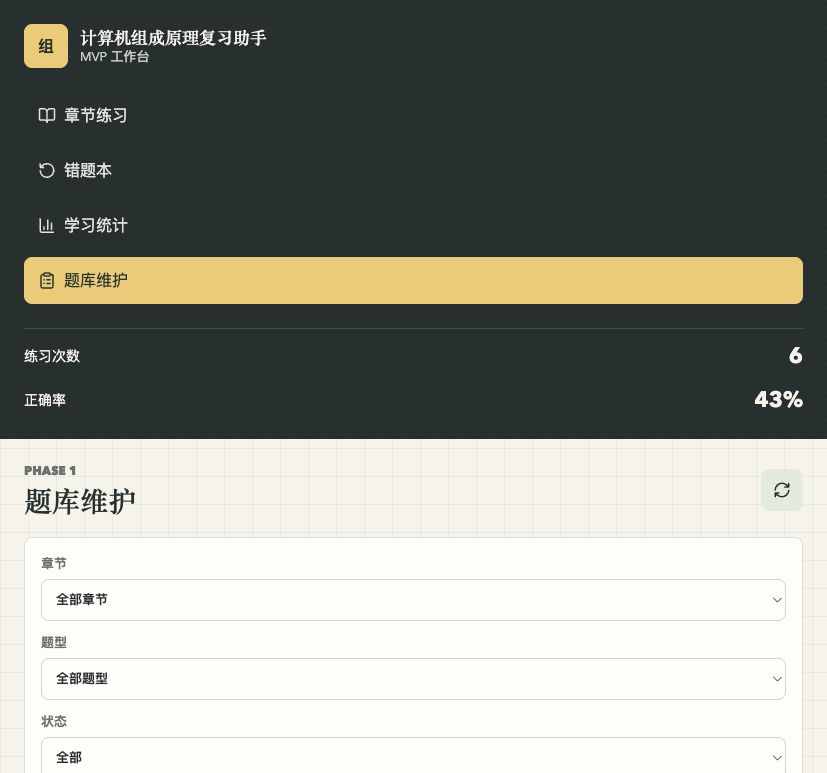

# 🖥️ 计算机组成原理复习助手

<p align="center">
  <strong>面向《计算机组成原理》课程的智能复习练习系统</strong>
</p>

<p align="center">
  
  
  
  
  
</p>

---

## ✨ 项目亮点

- 📚 **全面覆盖**：基于 9 章复习资料和历年真题，覆盖所有考点
- 🤖 **AI 智能**：AI 自动生成题目、实验模拟卷，智能推荐学习路径
- 📊 **数据驱动**：详细学习统计、章节掌握度分析、错题追踪
- 🎮 **游戏化体验**：彩蛋、动画、粒子特效，让学习不再枯燥
- 🚀 **一键部署**：Docker Compose + Caddy 自动 HTTPS，开箱即用

## 📸 项目截图

<table>
  <tr>
    <td></td>
    <td></td>
    <td></td>
  </tr>
  <tr>
    <td align="center">📝 练习系统</td>
    <td align="center">📖 知识库</td>
    <td align="center">⚙️ 题目管理</td>
  </tr>
</table>

---

## 🎯 核心功能

### 📝 练习系统

| 模式 | 说明 | 适用场景 |
|------|------|----------|
| 📚 **只做原题** | 仅练习原始题库中的题目 | 初次学习，打基础 |
| ⭐ **标准练习** | 原题 + 已验证的 AI 好题 | 巩固知识，查漏补缺 |
| 👥 **社区 AI 题库** | 社区用户共创的 AI 题目 | 拓展练习，挑战自我 |
| ✨ **AI 新题** | 实时生成全新 AI 题目 | 每日限额 50 道，保持新鲜感 |

**支持题型**：单选、多选、判断、填空、简答、计算

### 📊 学习统计

- **总览面板**：练习次数、作答总数、正确率、未掌握错题数
- **章节掌握度**：0-100 分评分，进度条带 shimmer 光泽动画
- **综合评估**：刷题数量、正确率、覆盖率、掌握率
- **学习建议**：基于数据的个性化推荐

### 📚 历年真题模拟

- 收录 **2017–2023 年共 7 套**历年真题试卷
- PDF 原卷 + 答案，支持在线预览与下载
- 逐题逐问作答，自动计时
- 原卷配图缩放查看

### 🔬 实验模拟考试

- AI 生成基于 **RISC-V RV32I + 多周期模型机**的实验试卷
- 覆盖选择题、汇编分析、CPU 设计（FSM/控制信号/Verilog）、拓展题
- 每日限额 1 次，后台异步生成，生成完成通知

### ❌ 错题本

- 自动记录答错题目，支持多次错题计数
- 错题重练：从错题本中抽题重新练习
- 标记已掌握功能

### 📖 知识库

- 基于 9 章复习笔记 DOCX 解析的知识点和知识块
- 按章节浏览知识点，全文检索知识块内容
- 课件 PDF 在线预览与下载

### 🎨 彩蛋 & 视觉美化

- 🌧️ 二进制雨背景动画（Canvas 0/1 飘落）
- 🔄 侧栏 Logo「组」可点击轮换为计/机/存/算/指/流等字符，带 360° 旋转
- ⌨️ 键盘彩蛋：输入 `comporg` / `riscv` / `alu` / `cpu` 触发粒子爆发 + 金色 toast
- 🏷️ 顶栏版本号可点击切换（流水线级 → 超标量级 → Alpha 0xDEAD…）
- 💡 底部自动轮播计组冷知识（10 条）

---

## 🛠️ 技术栈

<table>
  <tr>
    <td><strong>层级</strong></td>
    <td><strong>技术</strong></td>
    <td><strong>说明</strong></td>
  </tr>
  <tr>
    <td>前端</td>
    <td>Vue 3 + Vite + TypeScript</td>
    <td>响应式 UI，组件化开发</td>
  </tr>
  <tr>
    <td>后端</td>
    <td>FastAPI + SQLAlchemy</td>
    <td>高性能异步 API，ORM 映射</td>
  </tr>
  <tr>
    <td>数据库</td>
    <td>PostgreSQL 16 (Docker)</td>
    <td>可靠的关系型数据库</td>
  </tr>
  <tr>
    <td>AI 出题</td>
    <td>OpenAI 兼容接口</td>
    <td>可配置模型，灵活扩展</td>
  </tr>
  <tr>
    <td>认证</td>
    <td>JWT (python-jose + passlib/bcrypt)</td>
    <td>安全的用户认证</td>
  </tr>
  <tr>
    <td>部署</td>
    <td>Docker Compose + Caddy</td>
    <td>容器化部署，自动 HTTPS</td>
  </tr>
</table>

---

## 🚀 快速开始

### 前置要求

- Docker & Docker Compose
- Python 3.10+
- Node.js 18+

### 1. 克隆项目

```bash
git clone https://github.com/your-username/comp-org-review-assistant.git
cd comp-org-review-assistant
```

### 2. 启动数据库

```bash
docker compose up -d
```

### 3. 启动后端

```bash
# 创建虚拟环境
python3 -m venv .venv
source .venv/bin/activate  # Windows: .venv\Scripts\activate

# 安装依赖
pip install -r backend/requirements.txt

# 配置环境变量
cp .env.example .env
# 编辑 .env 填入 AI_API_KEY 和 SECRET_KEY

# 导入数据
cd backend
python scripts/seed_sample_questions.py
python scripts/import_homework_questions.py
python scripts/import_review_notes.py

# 可选：批量生成 AI 题目（自动跳过题目充足的章节）
python scripts/batch_generate_ai.py

# 启动服务
uvicorn app.main:app --reload --port 8000
```

### 4. 启动前端

```bash
cd frontend
npm install
npm run dev
```

访问 http://localhost:5173 🎉

---

## 🐳 生产部署

### Docker Compose 部署

```bash
# 1. 创建 .env 文件并配置
cp .env.production.example .env
# 编辑 .env，至少修改 POSTGRES_PASSWORD、SECRET_KEY。
# 有域名后把 PUBLIC_SITE_ADDRESS 改为你的域名，例如 review.example.com。

# 2. 启动所有服务
docker compose -f docker-compose.prod.yml up -d --build

# 3. 首次创建 postgres_data 数据卷时，docker/postgres/init/*.sql 会自动初始化数据库。

# 4. 导入数据
docker exec -it comp-org-backend python scripts/seed_sample_questions.py
docker exec -it comp-org-backend python scripts/import_homework_questions.py
docker exec -it comp-org-backend python scripts/import_review_notes.py

# 5. 可选：提前批量生成 AI 题
docker exec -it comp-org-backend python scripts/batch_generate_ai.py
```

访问 `http://服务器IP`。绑定域名并把 `.env` 中的 `PUBLIC_SITE_ADDRESS` 改成域名后，Caddy 会自动申请 HTTPS 证书。

### 服务架构

```
┌─────────────────────────────────────────────────────────────┐
│                      Caddy (:80/:443)                       │
│                     (自动 HTTPS 证书)                        │
└─────────────────────────────────────────────────────────────┘
                              │
                              ▼
┌─────────────────────────────────────────────────────────────┐
│                 Frontend (Nginx :80)                         │
│                   (静态文件服务)                              │
└─────────────────────────────────────────────────────────────┘
                              │
                              ▼
┌─────────────────────────────────────────────────────────────┐
│                Backend (FastAPI :8000)                        │
│                   (API 服务)                                 │
└─────────────────────────────────────────────────────────────┘
                              │
                              ▼
┌─────────────────────────────────────────────────────────────┐
│              PostgreSQL (:5432)                              │
│                   (数据库)                                   │
└─────────────────────────────────────────────────────────────┘
```

### 数据库备份与迁移

```bash
# 1. 本地导出数据库
./scripts/db_backup.sh export

# 2. 将备份文件上传到服务器
scp ./backups/comp_org_backup_*.sql.gz user@server:/path/to/project/

# 3. 服务器上导入（先启动容器，再导入）
docker compose -f docker-compose.prod.yml up -d
./scripts/db_backup.sh import ./backups/comp_org_backup_*.sql.gz

# 查看数据库状态
./scripts/db_backup.sh status
```

备份包含：章节、知识点、所有题目（含 AI 题）、练习记录、错题本、用户账号、知识库。

### 服务器更新

```bash
cd /path/to/project
git pull origin main

# 仅代码变更时重建 backend/frontend
docker compose -f docker-compose.prod.yml up -d --build

# materials/ 是 volume 挂载，git pull 后自动生效，无需重建
```

---

## ⚙️ 环境变量

| 变量名 | 说明 | 默认值 |
|--------|------|--------|
| `PUBLIC_SITE_ADDRESS` | 公网访问地址 | `:80` |
| `CORS_ORIGINS` | 允许跨域访问的前端来源 | - |
| `AI_API_KEY` | AI 服务 API Key | - |
| `AI_BASE_URL` | AI 服务地址 | - |
| `AI_MODEL` | AI 模型名称 | - |
| `AI_ENABLED` | 是否启用 AI 出题 | `true` |
| `AI_REQUEST_TIMEOUT` | AI 请求超时秒数 | `45` |
| `COURSEWARE_PDF_DIR` | 课件 PDF 目录 | `/materials/courseware-pdfs` |
| `SECRET_KEY` | JWT 认证密钥 | - |
| `TOKEN_ALGORITHM` | JWT 算法 | `HS256` |
| `TOKEN_EXPIRE_MINUTES` | Token 过期时间 | `1440` |

---

## 📁 项目结构

```
comp-org-review-assistant/
├── backend/                    # 后端服务
│   ├── app/
│   │   ├── api/                # API 路由
│   │   │   ├── routes.py       # 路由定义
│   │   │   └── deps.py         # 依赖注入（认证）
│   │   ├── models/             # 数据模型
│   │   │   └── entities.py     # SQLAlchemy 模型
│   │   ├── schemas/            # 请求/响应 Schema
│   │   │   └── api.py          # Pydantic 模型
│   │   ├── services/           # 业务逻辑
│   │   │   ├── ai_generation.py        # AI 题目生成
│   │   │   └── lab_exam_generation.py  # 实验模拟卷生成
│   │   └── core/               # 核心配置
│   │       ├── config.py       # 配置管理
│   │       ├── database.py     # 数据库连接
│   │       ├── security.py     # JWT 认证
│   │       ├── limiter.py      # 速率限制
│   │       └── logging.py      # 日志配置
│   ├── scripts/                # 数据导入脚本
│   │   ├── structure_exam_papers.py    # 历年试卷结构化
│   │   ├── download_exam_papers.py     # 试卷下载
│   │   └── crop_exam_diagrams.py       # 试卷配图裁剪
│   ├── tests/                  # 后端测试
│   └── Dockerfile              # 后端容器配置
├── frontend/                   # 前端应用
│   ├── src/
│   │   ├── components/         # Vue 组件
│   │   │   ├── LoginView.vue           # 登录页面
│   │   │   ├── GuideModal.vue          # 使用指南弹窗
│   │   │   ├── PracticeView.vue        # 练习页面
│   │   │   ├── ExamMockView.vue        # 历年真题模拟
│   │   │   ├── LabExamMockView.vue     # 实验模拟考试
│   │   │   ├── WrongQuestionsView.vue  # 错题本
│   │   │   ├── StatsView.vue           # 学习统计
│   │   │   ├── KnowledgeView.vue       # 知识库
│   │   │   └── BinaryRain.vue          # 二进制雨背景
│   │   ├── composables/        # 组合式函数
│   │   │   ├── useAuth.ts              # 认证状态管理
│   │   │   ├── useSharedState.ts       # 共享状态
│   │   │   └── useEasterEggs.ts        # 彩蛋逻辑
│   │   ├── api/                # API 客户端
│   │   │   └── client.ts       # Axios 封装
│   │   └── styles/             # 样式文件
│   │       └── global.css      # 全局样式
│   ├── Dockerfile              # 前端容器配置
│   └── nginx.conf              # Nginx 配置
├── materials/                  # 课程资料
│   ├── exam-papers/            # 历年真题（PDF + 图片 + JSON）
│   ├── lab-exams/              # 实验模拟卷
│   └── courseware-pdfs/        # 课件 PDF
├── scripts/                    # 工具脚本
│   └── db_backup.sh            # 数据库备份与恢复
├── deploy/                     # 部署配置
│   └── Caddyfile               # Caddy 反向代理配置
├── docker/                     # Docker 配置
│   └── postgres/init/          # 数据库初始化 SQL
├── docker-compose.yml          # 开发环境
└── docker-compose.prod.yml     # 生产环境
```

---

## 📖 使用指南

### 首次登录

1. 使用学号（8 位数字）和密码注册账号
2. 登录后会显示使用指南弹窗
3. 可选择"下次不再显示"来关闭弹窗

### 练习模式选择

- **只做原题**：适合初次练习，熟悉基础知识点
- **标准练习**：原题 + 社区验证的 AI 好题，巩固知识
- **社区 AI 题库**：社区用户共创的 AI 题目，拓展练习
- **AI 新题**：实时生成新题，每日限额 50 道

### 真题模拟

- 选择年份进入模拟考试，系统自动计时
- 逐题逐问作答，支持原卷配图缩放查看
- 可随时查看原卷 PDF 或答案 PDF

### 实验模拟

- AI 生成基于 RISC-V 的实验模拟试卷
- 每日限生成 1 次，生成完成后可反复练习

### 学习建议

1. 📚 先完成"只做原题"模式，建立知识基础
2. ⭐ 使用"标准练习"巩固知识
3. 📝 尝试"真题模拟"检验综合能力
4. 📊 关注学习统计中的章节掌握度，查漏补缺
5. ❌ 定期进行错题复盘，强化薄弱环节

### 彩蛋发现

- 🖱️ 点击侧栏金色「组」Logo
- ⌨️ 在页面任意位置输入 `comporg`、`riscv`、`alu`、`cpu`
- 🏷️ 点击顶栏版本号
- 👀 关注底部轮播冷知识

---

## 🤝 贡献指南

欢迎贡献代码、报告问题或提出建议！

1. Fork 本仓库
2. 创建特性分支 (`git checkout -b feature/AmazingFeature`)
3. 提交更改 (`git commit -m 'Add some AmazingFeature'`)
4. 推送到分支 (`git push origin feature/AmazingFeature`)
5. 创建 Pull Request

---

## 📄 免责声明

> ⚠️ **重要提示**

本系统知识库从 HDU 教学课件中提取，仅供学习参考使用。系统内容可能存在疏漏或偏差，不保证与教材完全一致。AI 生成的题目基于大语言模型，可能存在错误或不准确之处，请结合教材和课堂内容进行判断。

**本系统不构成任何形式的考试承诺或成绩保证**，使用者应自行承担使用风险。如有疑问，请以任课教师的讲解和官方教材为准。

---

## 📞 联系方式

如有问题或建议，请通过以下方式联系：

- 提交 [Issue](https://github.com/your-username/comp-org-review-assistant/issues)
- 发送邮件至：your-email@example.com

---

<p align="center">
  <sub>Made with ❤️ for HDU Computer Organization students</sub>
</p>
